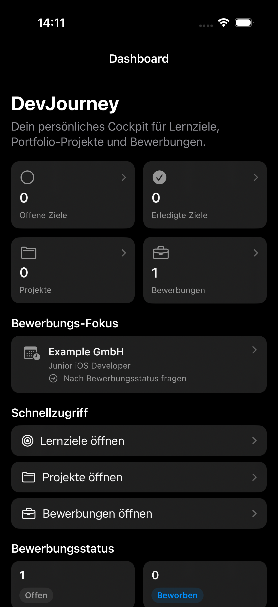

# DevJourney 0.3

DevJourney is a personal career and portfolio cockpit for junior developers. The SwiftUI app combines learning goals, portfolio projects, and job applications with a clear view of what deserves attention next.

Version 0.3 adds a next action and optional follow-up date for job applications. The dashboard selects the earliest dated open action, then falls back to undated actions, so the next application task stays visible without reminders or background services. This builds on the project milestones and portfolio-readiness workflow introduced in version 0.2 without expanding the deliberately lightweight architecture.

## Screenshots

| Portfolio focus | Project readiness | Application focus |
| --- | --- | --- |
|  |  |  |

## Features

- Track learning goals with completion state and optional target date
- Manage portfolio projects with status, description, notes, and optional GitHub link
- Add, edit, reorder, complete, and delete project milestones
- Review a fixed six-point portfolio-readiness checklist with progress
- See the next open milestone or readiness requirement for every project
- Filter projects by open attention and portfolio readiness alongside search
- Identify portfolio-ready projects and the project with the most open work on the dashboard
- Track job applications by company, position, status, and optional application date
- Plan the next application action with an optional follow-up date
- See the most urgent open application action and due count on the dashboard
- Review key metrics and application status distribution with Swift Charts
- Persist all app data locally with SwiftData

## Portfolio Readiness

Every project uses the same focused checklist:

1. The app works reliably.
2. Tests are available.
3. The README is complete.
4. Screenshots are available.
5. An app icon is available.
6. A case study or project documentation is available.

The next action is intentionally deterministic: DevJourney selects the first open milestone by order, then the first open readiness requirement. A project is portfolio-ready only when all six readiness requirements are complete.

## Tech Stack

- SwiftUI for the user interface
- SwiftData for local persistence
- MVVM-light for feature and dashboard logic
- Swift Charts for dashboard visualization
- Swift Testing and XCTest for unit and UI coverage

## Architecture

The project follows a small feature-first structure:

```text
DevJourney/
├── App/
├── Features/
│   ├── Applications/
│   ├── Dashboard/
│   ├── Goals/
│   └── Projects/
└── Models/
```

- Views handle layout and navigation.
- ViewModels handle form state, validation, persistence actions, and dashboard calculations.
- SwiftData models represent persisted app data and small project-domain calculations.
- Shared status and readiness definitions are centralized in the model layer.

No service or repository layer is used because all data remains local and the current feature scope does not require one.

## SwiftData Migrations

DevJourney 0.2 defines the persisted baseline as `DevJourneySchemaV1` with schema version `1.0.0`. Version 0.3 uses `DevJourneySchemaV2` with version `2.0.0`; it adds application next-action and follow-up fields through a lightweight migration. Every app container, including the in-memory UI-test container, uses `DevJourneyMigrationPlan`.

For future persisted model changes:

1. Preserve the V1 model shape before changing properties or relationships.
2. Add a new `VersionedSchema` instead of replacing the V1 baseline.
3. Append the new schema and an explicit lightweight or custom migration stage to `DevJourneyMigrationPlan`.
4. Extend the migration tests with representative data from the previous schema.
5. Never delete the persistent store as an automatic recovery path for migration failures.

The `--reset-store` launch argument remains an explicit DEBUG-only development tool and is not part of production migration behavior.

## Tests

The unit suite covers validation and persistence behavior across goals, projects, applications, and the dashboard. Versions 0.2 and 0.3 specifically verify:

- readiness progress and complete portfolio-ready projects
- deterministic next-step selection
- completed projects and projects without milestones
- milestone creation, editing, and persistence
- dashboard readiness counts and attention prioritization
- follow-up validation, due-state calculation, and deterministic dashboard prioritization
- migration of unversioned and versioned V1 stores to V2 without data loss

UI tests cover creating a learning goal, dashboard navigation, launch behavior, and the complete project milestone and readiness workflow.
They also cover creating an application action, showing it in the application list, and surfacing it on the dashboard.

Run the unit suite with:

```bash
DEVELOPER_DIR=/Applications/Xcode.app/Contents/Developer xcodebuild \
  -project DevJourney/DevJourney.xcodeproj \
  -scheme DevJourney \
  -destination 'platform=iOS Simulator,name=iPhone 17' \
  -only-testing:DevJourneyTests \
  test
```

## Scope

DevJourney 0.3 is intentionally local and single-user. Cloud sync, authentication, AI prioritization, reminders, and exports remain out of scope.

Possible next iterations are broader accessibility regression coverage and release automation.
