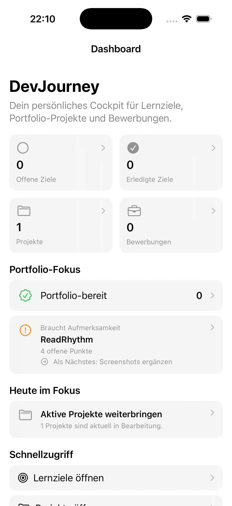
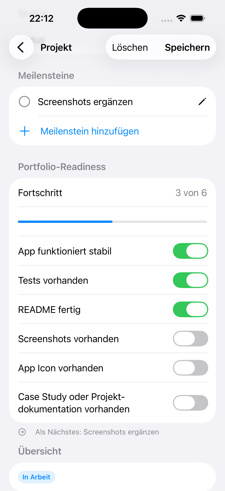

# DevJourney 0.2

DevJourney is a personal career and portfolio cockpit for junior developers. The SwiftUI app combines learning goals, portfolio projects, and job applications with a clear view of what deserves attention next.

Version 0.2 adds project milestones and a compact portfolio-readiness workflow without expanding the deliberately lightweight architecture.

## Screenshots

| Portfolio focus | Project readiness |
| --- | --- |
|  |  |

## Features

- Track learning goals with completion state and optional target date
- Manage portfolio projects with status, description, notes, and optional GitHub link
- Add, edit, reorder, complete, and delete project milestones
- Review a fixed six-point portfolio-readiness checklist with progress
- See the next open milestone or readiness requirement for every project
- Identify portfolio-ready projects and the project with the most open work on the dashboard
- Track job applications by company, position, status, and optional application date
- Review key metrics and application status distribution with Swift Charts
- Persist all app data locally with SwiftData

## Portfolio Readiness

Every project uses the same focused checklist:

1. The app works reliably.
2. Tests are available.
3. The README is complete.
4. Screenshots are available.
5. An app icon is available.
6. A case study or project documentation is available.

The next action is intentionally deterministic: DevJourney selects the first open milestone by order, then the first open readiness requirement. A project is portfolio-ready only when all six readiness requirements are complete.

## Tech Stack

- SwiftUI for the user interface
- SwiftData for local persistence
- MVVM-light for feature and dashboard logic
- Swift Charts for dashboard visualization
- Swift Testing and XCTest for unit and UI coverage

## Architecture

The project follows a small feature-first structure:

```text
DevJourney/
├── App/
├── Features/
│   ├── Applications/
│   ├── Dashboard/
│   ├── Goals/
│   └── Projects/
└── Models/
```

- Views handle layout and navigation.
- ViewModels handle form state, validation, persistence actions, and dashboard calculations.
- SwiftData models represent persisted app data and small project-domain calculations.
- Shared status and readiness definitions are centralized in the model layer.

No service or repository layer is used because all data remains local and the current feature scope does not require one.

## Tests

The unit suite covers validation and persistence behavior across goals, projects, applications, and the dashboard. Version 0.2 specifically verifies:

- readiness progress and complete portfolio-ready projects
- deterministic next-step selection
- completed projects and projects without milestones
- milestone creation, editing, and persistence
- dashboard readiness counts and attention prioritization

UI tests cover creating a learning goal, dashboard navigation, launch behavior, and the complete project milestone and readiness workflow.

Run the unit suite with:

```bash
DEVELOPER_DIR=/Applications/Xcode.app/Contents/Developer xcodebuild \
  -project DevJourney/DevJourney.xcodeproj \
  -scheme DevJourney \
  -destination 'platform=iOS Simulator,name=iPhone 17' \
  -only-testing:DevJourneyTests \
  test
```

## Scope

DevJourney 0.2 is intentionally local and single-user. Cloud sync, authentication, AI prioritization, reminders, and exports remain out of scope.

Possible next iterations are broader accessibility regression coverage and an explicit migration plan if the SwiftData schema grows beyond additive changes with safe defaults.
